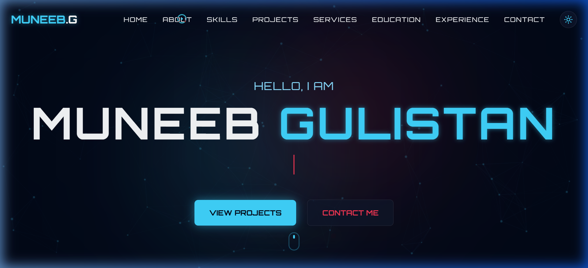

# 🌌 Muneeb Gulistan | Futuristic Portfolio

[](https://nextjs.org/)
[](https://tailwindcss.com/)
[](https://www.framer.com/motion/)
[](https://www.typescriptlang.org/)

A stunning, modern, and futuristic single-page portfolio website built for a high-end developer experience. Featuring neon aesthetics, glassmorphism, and advanced interactive animations.

---

## ✨ Features

- **🚀 Futuristic Hero Section**: Dynamic typing animation with a neon-glow aesthetic.
- **🎨 Glassmorphism UI**: Premium design with blurred backgrounds and subtle borders.
- **🌗 Dark/Light Mode**: Seamlessly switch between themes with a glowing toggle.
- **🖱️ Custom Animated Cursor**: Interactive cursor that reacts to hover states and elements.
- **🌌 Particle Background**: High-performance canvas-based particle system with connecting nodes.
- **📦 3D Project Cards**: Interactive cards that tilt and rotate in 3D space.
- **📱 Fully Responsive**: Optimized for everything from mobile devices to ultra-wide monitors.
- **📧 Working Contact Form**: Styled with futuristic inputs and a glassmorphic look.

---

## 🛠️ Tech Stack

- **Core**: [Next.js 14](https://nextjs.org/) (App Router)
- **Styling**: [Tailwind CSS v4](https://tailwindcss.com/)
- **Animations**: [Framer Motion](https://www.framer.com/motion/)
- **Icons**: [Lucide React](https://lucide.dev/) & [React Icons](https://react-icons.github.io/react-icons/)
- **Typography**: Orbitron (Headings) & Inter (Body)

---

## 📸 Preview



---

## 🚀 Getting Started

### Prerequisites

- Node.js 18.x or higher
- npm or yarn

### Installation

1. **Clone the repository**
   ```bash
   git clone https://github.com/muneeb-code3/portfolio.git
   cd portfolio
   ```

2. **Install dependencies**
   ```bash
   npm install
   ```

3. **Run the development server**
   ```bash
   npm run dev
   ```

4. **Open the site**
   Visit [http://localhost:3000](http://localhost:3000) to view your portfolio!

---

## 📁 Project Structure

```text
├── app/              # Next.js App Router (Layout & Pages)
├── components/       # Reusable UI Components
│   ├── sections/     # Individual Page Sections
│   └── ui/           # Global UI Elements (Navbar, Cursor, etc.)
├── public/           # Static Assets (Images, Icons)
└── styles/           # Global CSS & Tailwind Config
```

---

## 👤 Author

**Muneeb Gulistan**
- 🎓 BS Artificial Intelligence Student
- 💻 Web Developer & AI Learner
- 📸 Content Creator
-  Founding Member of **ARMAAS Solutions** & **Feedify Organization**

---

## 📄 License

This project is licensed under the MIT License - see the [LICENSE](LICENSE) file for details.

---

<p align="center">
  Built with 💙 by Muneeb Gulistan
</p>